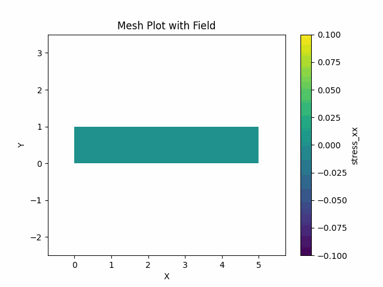

## pyTumu: A toy FEM package:

This is a toy FEM package, which is developed for learning purpose,
in my coursework of CGN 6905, Computational inelasticity, University of Florida.

**Can be used to solve the following problems:**

- Inelasticity for quasi static problems, J2 plasticity
- Linear elasticity, for static and dynamic problems
- Bar, Frame, Truss
- Euler and Timoshenko beam

## 1. Example: Elastic dynamic problem

Run `python elastic_dynamic.py`  
You would get the result:

## 2. Structure of the codes

- `pyTumu` is the main package
- Those are examples of using the package:
    - `1D_returnmapping.py`
    - `bar.py`
    - `elastic_dynamic.py`
    - `elasticity_static.py`
    - `eulerbeam.py`
    - `frame_dynamic.py`
    - `frame_static.py`
    - `J2_returnmapping.py`
    - `QuasiStatic_Plastic.py`
    - `timoshenkobeam.py`
    - `truss.py`